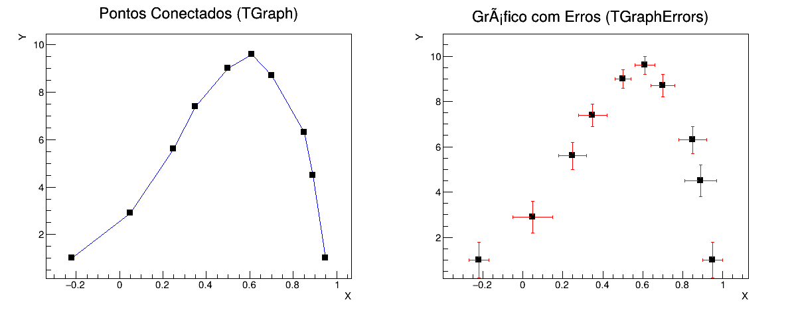

# Exercício 2: Gráficos de Dados e Barras de Erro (`TGraph` e `TGraphErrors`)

## Descrição do Problema
O objetivo deste exercício é realizar a leitura de dados numéricos a partir de arquivos de texto e representá-los graficamente utilizando as classes de dados discretos do CERN ROOT:

1. **`TGraph`:** Ler os pontos do arquivo `graphdata.txt`, estilizar os marcadores como caixas pretas (`kFullSquare`) e conectar os pontos por uma linha utilizando as opções do `TGraphPainter`.
2. **`TGraphErrors`:** Ler os pontos e suas respectivas incertezas ($x, y, e_x, e_y$) do arquivo `graphdata_error.txt` e exibir as barras de erro experimentais associadas.

---

## Explicação Detalhada do Código (`exercicio2.C`)

O código em C++ executa a leitura, formatação e renderização dos dois gráficos lado a lado em um mesmo `TCanvas`:

1. **Modo Batch (`gROOT->SetBatch(kTRUE)`):**
   * Configura o ROOT para rodar de forma não interativa (sem abrir janelas gráficas no sistema operacional), ideal para processamento em servidores remoto como o JupyterHub.

2. **Divisão do Canvas:**
   * É criado um `TCanvas` de dimensão $1200 \times 500$ dividido em 2 painéis através do comando `c2->Divide(2, 1)`.

3. **Parte 1 — Gráfico Simples (`TGraph`):**
   * **Leitura Direta:** O construtor `TGraph("graphdata.txt")` lê automaticamente as colunas $x$ e $y$ do arquivo de texto.
   * **Estilização:** O marcador é configurado com `SetMarkerStyle(kFullSquare)` (código 21 do ROOT) e cor preta (`kBlack`).
   * **Opção de Desenho `"ALP"`:** 
     * `A` (*Axis*): Desenha os eixos cartesianos.
     * `L` (*Line*): Desenha a linha contínua conectando os pontos.
     * `P` (*Points*): Desenha os marcadores nos pontos informados.

4. **Parte 2 — Gráfico com Incertezas (`TGraphErrors`):**
   * **Leitura de Erros:** O construtor `TGraphErrors("graphdata_error.txt")` faz a leitura estruturada de 4 colunas por linha: $x$, $y$, $e_x$ e $e_y$.
   * **Opção de Desenho `"AP"`:** Desenha os eixos (`A`) e os pontos com as respectivas barras de erro verticais e horizontais (`P`).

5. **Exportação dos Resultados:**
   * O resultado combinado é exportado simultaneamente nos formatos de imagem **PNG** (`exercicio2.png`) e gráfico vetorial **PDF** (`exercicio2.pdf`).

---

## Arquivos Requeridos no Repositório

Para o correto funcionamento deste código, a pasta `exercicio2/` deve conter os seguintes arquivos:
* `exercicio2.C` (Código fonte em C++)
* `graphdata.txt` (Arquivo de entrada com os pontos $x, y$)
* `graphdata_error.txt` (Arquivo de entrada com $x, y, e_x, e_y$)

## Resultado Gráfico

